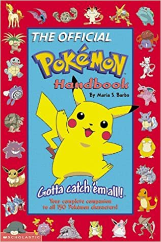
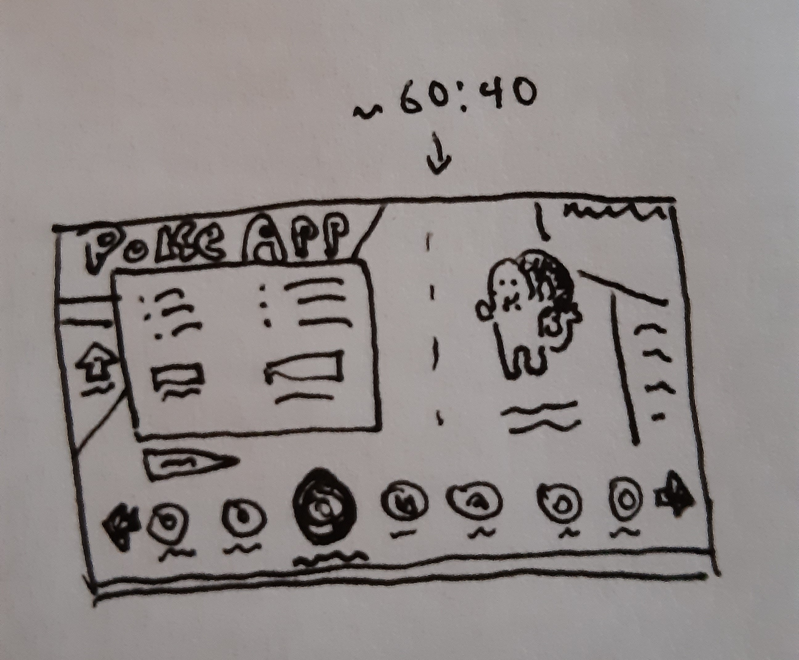

## PokéAPI App

# Summary

This is a simple app I started during a coding challenge. I realized I was a little rusty on spooling up a new web app during the challenge, so I decided to keep working on this for practice and as a neat little portfolio piece.

The Pokémon API this integrates with was created by Paul Hallett and other contributors - see https://pokeapi.co/ for more info.

# Noted Bugs / Planned Improvements

-   add a nice little loading gif for time it takes to load pokemon list
-   make individual pokemon clickable to get more info on them - pokedex entries, full type info, etc.
-   add an "about" page - link back to my main portfolio site
-   give it unique css styling - based on pokemon handbook 1999 ideally
-   add caching?
-   add text search which includes prefix and fuzzy matching for pokemon names
-   filter by color, generation, habitat

# Design Sketch / Inspiration

I have a lot of fond memories of flipping through The Official Pokemon Handbook as a kid, so it was pretty easy for me when thinking about the visual design to decide that I wanted to try and imitate its (very 1999) design sensibilities for this.
 

Here's my initial rough draft thumbnail, featuring a very good drawing of a Charmander.
 

