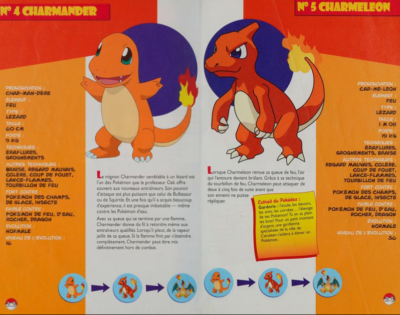

## PokéAPI App

# Summary

This is a simple app I started during a coding challenge. I realized I was a little rusty on spooling up a new web app during the challenge, so I decided to keep working on this for practice and as a neat little portfolio piece.

The Pokémon API this integrates with was created by Paul Hallett and other contributors - see https://pokeapi.co/ for more info.

# Planned Improvements

-   **in progress** add css handling for smaller screens
-   finalize styles - add diagonals
-   filter by color, generation, second type
-   change colors on pokedex display based on pokemon type
-   add text search which includes prefix and fuzzy matching for pokemon names
-   fix react warnings in console, fix accessibility warnings
-   add special style handling for non-standard evolution chains
-   add arrows to evolution display

# Known Issues

**PokeAPI bugs**

-   text for dex entries often has missing spaces
-   certain pokemon consistently return a NOT FOUND error when attempting to get their info (Mothim, Teddiursa)

**Technical issues**

**Visual/Style issues**

-   Pokemon with complex evolution chains - Eeveelutions are a good example - display of the evolution chain gets messy
-   UI doesn't fit properly on small screens - needs CSS work

# Design Sketch / Inspiration

I have a lot of fond memories of flipping through The Official Pokemon Handbook as a kid, so I pretty quickly decided that I wanted to try and imitate its (very 1999) design sensibilities for this.
 

Here's my initial rough draft thumbnail, featuring a very good drawing of a Charmander.
 

